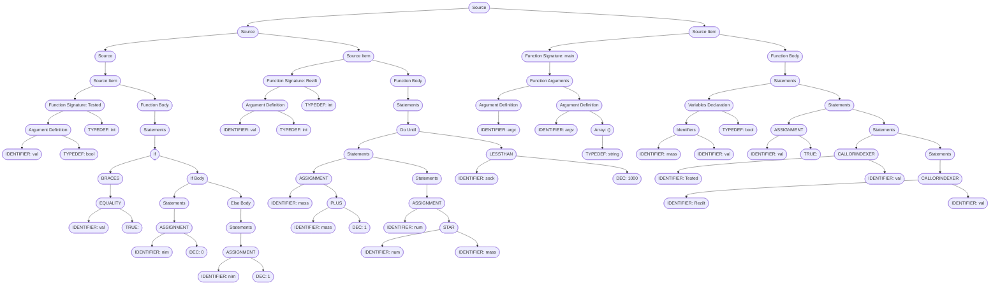

```mermaid
flowchart TB
node106(["Source"]) --> node69(["Source"])
node69(["Source"]) --> node35(["Source"])
node35(["Source"]) --> node34(["Source Item"])
node34(["Source Item"]) --> node10(["Function Signature: Tested"])
node10(["Function Signature: Tested"]) --> node6(["Argument Definition"])
node6(["Argument Definition"]) --> node3(["IDENTIFIER: val"])
node6(["Argument Definition"]) --> node5(["TYPEDEF: bool"])
node10(["Function Signature: Tested"]) --> node8(["TYPEDEF: int"])
node34(["Source Item"]) --> node33(["Function Body"])
node33(["Function Body"]) --> node31(["Statements"])
node31(["Statements"]) --> node29(["if"])
node29(["if"]) --> node14(["BRACES"])
node14(["BRACES"]) --> node13(["EQUALITY"])
node13(["EQUALITY"]) --> node11(["IDENTIFIER: val"])
node13(["EQUALITY"]) --> node12(["TRUE: "])
node29(["if"]) --> node28(["If Body"])
node28(["If Body"]) --> node20(["Statements"])
node20(["Statements"]) --> node18(["ASSIGNMENT"])
node18(["ASSIGNMENT"]) --> node16(["IDENTIFIER: nim"])
node18(["ASSIGNMENT"]) --> node17(["DEC: 0"])
node28(["If Body"]) --> node26(["Else Body"])
node26(["Else Body"]) --> node25(["Statements"])
node25(["Statements"]) --> node23(["ASSIGNMENT"])
node23(["ASSIGNMENT"]) --> node21(["IDENTIFIER: nim"])
node23(["ASSIGNMENT"]) --> node22(["DEC: 1"])
node69(["Source"]) --> node68(["Source Item"])
node68(["Source Item"]) --> node45(["Function Signature: Rezilt"])
node45(["Function Signature: Rezilt"]) --> node41(["Argument Definition"])
node41(["Argument Definition"]) --> node38(["IDENTIFIER: val"])
node41(["Argument Definition"]) --> node40(["TYPEDEF: int"])
node45(["Function Signature: Rezilt"]) --> node43(["TYPEDEF: int"])
node68(["Source Item"]) --> node67(["Function Body"])
node67(["Function Body"]) --> node65(["Statements"])
node65(["Statements"]) --> node64(["Do Until"])
node64(["Do Until"]) --> node58(["Statements"])
node58(["Statements"]) --> node50(["ASSIGNMENT"])
node50(["ASSIGNMENT"]) --> node46(["IDENTIFIER: mass"])
node50(["ASSIGNMENT"]) --> node49(["PLUS"])
node49(["PLUS"]) --> node47(["IDENTIFIER: mass"])
node49(["PLUS"]) --> node48(["DEC: 1"])
node58(["Statements"]) --> node57(["Statements"])
node57(["Statements"]) --> node55(["ASSIGNMENT"])
node55(["ASSIGNMENT"]) --> node51(["IDENTIFIER: num"])
node55(["ASSIGNMENT"]) --> node54(["STAR"])
node54(["STAR"]) --> node52(["IDENTIFIER: num"])
node54(["STAR"]) --> node53(["IDENTIFIER: mass"])
node64(["Do Until"]) --> node63(["LESSTHAN"])
node63(["LESSTHAN"]) --> node60(["IDENTIFIER: sock"])
node63(["LESSTHAN"]) --> node61(["DEC: 1000"])

node106(["Source"]) --> node105(["Source Item"])
node105(["Source Item"]) --> node82(["Function Signature: main"])
node82(["Function Signature: main"]) --> node80(["Function Arguments"])
node80(["Function Arguments"]) --> node73(["Argument Definition"])
node73(["Argument Definition"]) --> node72(["IDENTIFIER: argc"])
node80(["Function Arguments"]) --> node79(["Argument Definition"])
node79(["Argument Definition"]) --> node74(["IDENTIFIER: argv"])
node79(["Argument Definition"]) --> node78(["Array: ()"])
node78(["Array: ()"]) --> node76(["TYPEDEF: string"])
node105(["Source Item"]) --> node104(["Function Body"])
node104(["Function Body"]) --> node102(["Statements"])
node102(["Statements"]) --> node89(["Variables Declaration"])
node89(["Variables Declaration"]) --> node86(["Identifiers"])
node86(["Identifiers"]) --> node83(["IDENTIFIER: mass"])
node86(["Identifiers"]) --> node84(["IDENTIFIER: val"])
node89(["Variables Declaration"]) --> node87(["TYPEDEF: bool"])
node102(["Statements"]) --> node101(["Statements"])
node101(["Statements"]) --> node91(["ASSIGNMENT"])
node91(["ASSIGNMENT"]) --> node88(["IDENTIFIER: val"])
node91(["ASSIGNMENT"]) --> node90(["TRUE: "])
node101(["Statements"]) --> node100(["Statements"])
node100(["Statements"]) --> node94(["CALLORINDEXER"])
node94(["CALLORINDEXER"]) --> node92(["IDENTIFIER: Tested"])
node94(["CALLORINDEXER"]) --> node93(["IDENTIFIER: val"])
node100(["Statements"]) --> node99(["Statements"])
node99(["Statements"]) --> node97(["CALLORINDEXER"])
node97(["CALLORINDEXER"]) --> node95(["IDENTIFIER: Rezilt"])
node97(["CALLORINDEXER"]) --> node96(["IDENTIFIER: val"])
```
