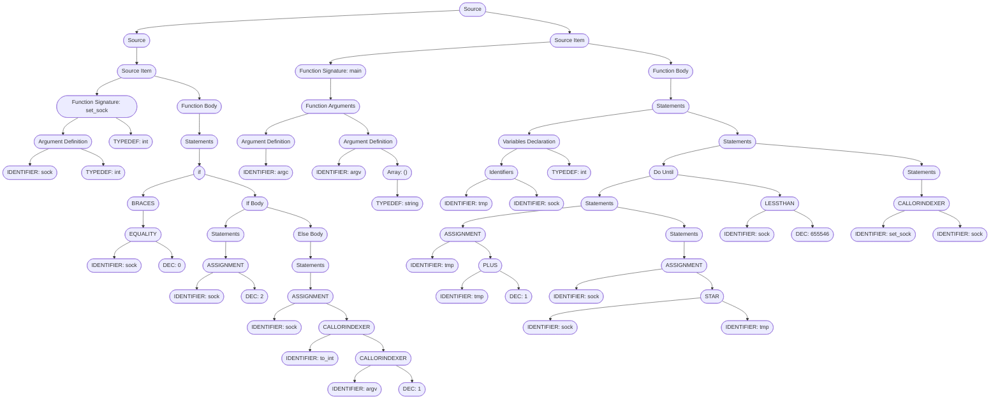

```mermaid
flowchart TB
node88(["Source"]) --> node39(["Source"])
node39(["Source"]) --> node38(["Source Item"])
node38(["Source Item"]) --> node10(["Function Signature: set_sock"])
node10(["Function Signature: set_sock"]) --> node6(["Argument Definition"])
node6(["Argument Definition"]) --> node3(["IDENTIFIER: sock"])
node6(["Argument Definition"]) --> node5(["TYPEDEF: int"])
node10(["Function Signature: set_sock"]) --> node8(["TYPEDEF: int"])
node38(["Source Item"]) --> node37(["Function Body"])
node37(["Function Body"]) --> node35(["Statements"])
node35(["Statements"]) --> node33(["if"])
node33(["if"]) --> node14(["BRACES"])
node14(["BRACES"]) --> node13(["EQUALITY"])
node13(["EQUALITY"]) --> node11(["IDENTIFIER: sock"])
node13(["EQUALITY"]) --> node12(["DEC: 0"])
node33(["if"]) --> node32(["If Body"])
node32(["If Body"]) --> node20(["Statements"])
node20(["Statements"]) --> node18(["ASSIGNMENT"])
node18(["ASSIGNMENT"]) --> node16(["IDENTIFIER: sock"])
node18(["ASSIGNMENT"]) --> node17(["DEC: 2"])
node32(["If Body"]) --> node30(["Else Body"])
node30(["Else Body"]) --> node29(["Statements"])
node29(["Statements"]) --> node27(["ASSIGNMENT"])
node27(["ASSIGNMENT"]) --> node21(["IDENTIFIER: sock"])
node27(["ASSIGNMENT"]) --> node26(["CALLORINDEXER"])
node26(["CALLORINDEXER"]) --> node22(["IDENTIFIER: to_int"])
node26(["CALLORINDEXER"]) --> node25(["CALLORINDEXER"])
node25(["CALLORINDEXER"]) --> node23(["IDENTIFIER: argv"])
node25(["CALLORINDEXER"]) --> node24(["DEC: 1"])

node88(["Source"]) --> node87(["Source Item"])
node87(["Source Item"]) --> node52(["Function Signature: main"])
node52(["Function Signature: main"]) --> node50(["Function Arguments"])
node50(["Function Arguments"]) --> node43(["Argument Definition"])
node43(["Argument Definition"]) --> node42(["IDENTIFIER: argc"])
node50(["Function Arguments"]) --> node49(["Argument Definition"])
node49(["Argument Definition"]) --> node44(["IDENTIFIER: argv"])
node49(["Argument Definition"]) --> node48(["Array: ()"])
node48(["Array: ()"]) --> node46(["TYPEDEF: string"])
node87(["Source Item"]) --> node86(["Function Body"])
node86(["Function Body"]) --> node84(["Statements"])
node84(["Statements"]) --> node59(["Variables Declaration"])
node59(["Variables Declaration"]) --> node56(["Identifiers"])
node56(["Identifiers"]) --> node53(["IDENTIFIER: tmp"])
node56(["Identifiers"]) --> node54(["IDENTIFIER: sock"])
node59(["Variables Declaration"]) --> node57(["TYPEDEF: int"])
node84(["Statements"]) --> node83(["Statements"])
node83(["Statements"]) --> node78(["Do Until"])
node78(["Do Until"]) --> node72(["Statements"])
node72(["Statements"]) --> node64(["ASSIGNMENT"])
node64(["ASSIGNMENT"]) --> node60(["IDENTIFIER: tmp"])
node64(["ASSIGNMENT"]) --> node63(["PLUS"])
node63(["PLUS"]) --> node61(["IDENTIFIER: tmp"])
node63(["PLUS"]) --> node62(["DEC: 1"])
node72(["Statements"]) --> node71(["Statements"])
node71(["Statements"]) --> node69(["ASSIGNMENT"])
node69(["ASSIGNMENT"]) --> node65(["IDENTIFIER: sock"])
node69(["ASSIGNMENT"]) --> node68(["STAR"])
node68(["STAR"]) --> node66(["IDENTIFIER: sock"])
node68(["STAR"]) --> node67(["IDENTIFIER: tmp"])
node78(["Do Until"]) --> node77(["LESSTHAN"])
node77(["LESSTHAN"]) --> node74(["IDENTIFIER: sock"])
node77(["LESSTHAN"]) --> node75(["DEC: 655546"])
node83(["Statements"]) --> node82(["Statements"])
node82(["Statements"]) --> node80(["CALLORINDEXER"])
node80(["CALLORINDEXER"]) --> node76(["IDENTIFIER: set_sock"])
node80(["CALLORINDEXER"]) --> node79(["IDENTIFIER: sock"])
```
